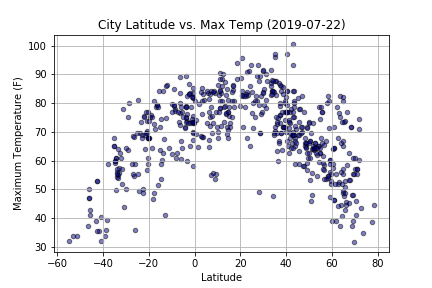
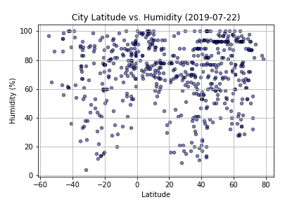
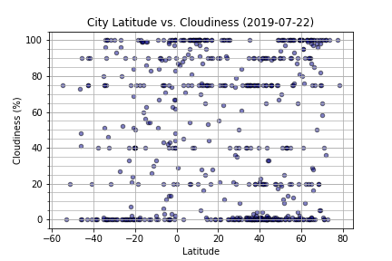
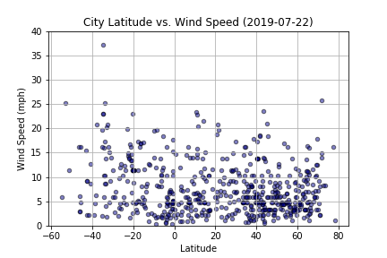

# pyWeather
Weather analysis based on latitudes.

An analysis on random cities around the globe to determine trends based on latitude. More specifically, what happens as you approach the equator? Besides the obvious answer "it gets warmer", the following study aims to validate this theory.

Numbers in the latitude range (-90 ot 90) and longitude range (-180 to 180) were chosen at random and citipy library was used to determine ther nearest stored city to these random points.

I used the Open Weather Map API to pull the following data for all cities:
* Latitude
* Temperature (F)
* Humidity (%)
* Cloudiness (%)
* Wind Speed (mph)

## Results and Observations

* A clear curve shows that temperatures are generally hotter towards the equator (latitude 0).

* It is the least humid near the Tropic of Cancer and Tropic of Capricorn (23.5 degrees above and below the equator respectively).

* There is a biased toward coverage on the increments of 5.
* On the day the data was retrieved it was uncommon to have no wind coverage just north of the equator (latitude 0 to 15).

* The day the data was retrieved it was more windy north of the equator (positive latitudes).

Miscellaneous observations:

* More data is acquired north of the equator, no data past latitude range -60 proabbly due to the fact Antarctica has no cities.
* According to Abel Mendez (Planetary Habitability Laboratory) "land areas are distributed predominantly in the Northern Hemisphere (68%) relative to the Southern Hemisphere (32%) as divided by the equator." This could be another cause for data skew.

**In summary, we have proved our hypothesis to be true. If you don't like warm weather stay away from latitude 0, because it does get hotter as you approach the equator.**